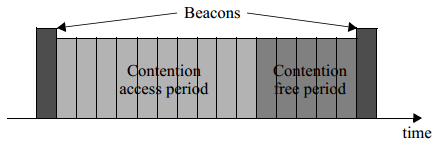

# 4.5 功能概述

　　本节简要描述了 LR-WPAN 的基本功能。

## 4.5.1 超帧结构

　　IEEE 802.15.4 允许使用超帧结构。超帧的格式由协调器定义。如图 4a 所示，协调器发送的信标帧是超帧的分界线，且每个超帧被分为 16 个持续时间相等的时隙。如图 4b 所示，超帧由活跃期和(可选)非活跃期两部分组成。在非活跃期，协调器能进入低功耗模式。信标帧位于超帧的第一个时隙，标志着一个新超帧结构的开始。如果协调器不想使用超帧结构，它可以不传输超帧。信标的作用是与附着设备同步、标识 PAN 网络以及描述超帧的结构。

图 4. 超帧的结构

　　如果一个设备想在两个信标帧之间的竞争访问时期(CAP)与其它设备通信，它必须使用时隙版 CSMA/CA 机制或 ALOHA 机制访问信道。有一些应用需要低延迟或者特定的数据带宽，PAN 协调器可以直接将超帧的一部分活跃期分配给该应用。这段时间叫做有保证的时隙(GTS)。如图 5 所示，GTS 属于免竞争时期(CFP)，总是出现在超帧有效期内的结尾，并将竞争访问时期结束后的第一个时隙边界作为开始。协调器最多可以分配七个 GTS，且每个 GTS 可以占有多个时隙。不过，协调器必须保证 CAP 的时隙是足够充足，可以让网络中的设备基于竞争访问，或者让其它设备加入到本网络。所有基于竞争的传输都在 CFP 开始之前完成。传输 GTS 的设备也必须保证自己的传输工作在下一个 GTS 开始之前，或者 CFP 结束之前完成。关于超帧结构的更多信息请参考 5.1.1.1。

图 5. 带有 GTS 的活跃期结构

