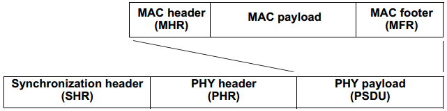

# 4.5.3 帧结构

　　设计帧结构主要考虑两方面，其一是使帧结构尽可能简单，其二是保证在具有噪声的信道中传输时保持健壮性。每一层的协议都会在这个结构上添加本层相关的头部和尾部。本标准定义了四种帧结构：

　　—— 信标帧，协调器使用信标帧传输信标。

　　—— 数据帧，用于传输数据。

　　—— 确认帧，用于确认成功接收到到帧。

　　—— MAC 命令帧，用于处理所有 MAC 对等的实体控制传输。

　　MAC 帧会传递给物理层，作为 PHY 服务数据单元(PSDU)，成为物理层的负载。物理层协议数据单元如图 6 所示。

图 6. PPDU 的示意图

　　SHR 和 PHR 的格式在物理层的相应各章中定义。MHR 和 MFR 在 5.2.1 节定义。

---

　　**本节专有名词**

 简写 | 英文全称 | 中文全称
 ---- | ---- | ----
 PSDU | PHY service data unit | 物理层服务数据单元
