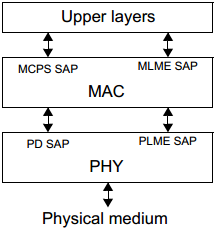

# 4.4 架构

　　为了简化标准，IEEE 802.15.4 的架构被分成多个模块，这些模块称为层。每一层负责完成所规定的任务，并且向上一层提供服务。

　　本标准定义了使用逻辑链路来提供服务的各层之间的接口。

　　一个 LR-WPAN 设备至少需要一个 PHY 和一个 MAC 子层，其中 PHY 包括伴随着低等控制机制的射频(RF)收发机， MAC 子层为各种传输提供到达物理通道的接口。图 3 描述了它们之间的图形化关系，更详细的描述请参考 4.4.1 节和 4.4.2 节。

图 3. LR-WPAN 设备的架构

　　图 3 所示的上层(Upper layers)包括网络层和应用层，其中网络层提供网络的配置、操作和信息路由功能，应用层提供设备的既定功能。这些上层的定义超出了本标准的讨论范围。

## 4.4.1 物理层 PHY
　　物理层提供了两种类型的服务：PHY 数据服务和 PHY 管理服务。PHY 数据服务使 PHY 能通过物理无线信道传输和接收 PHY 协议数据单元(PPDU)。第 8 章描述了 PHY 的通用需求。

　　PHY 提供的功能包括启动和关闭收发器、能量检测(ED)、链路质量检测(LQI)、信道选择、信道忙闲评估(CCA)，以及通过物理媒介对数据包进行发送和接收。此外，UWB PHY 还能进行精确测距。

　　“*Coexistence analysis of IEEE Std 802.15.4 with other IEEE standards and proposed standards*” 给出了关于各种 IEEE 802.15.4 PHY 与其它无线系统的共存问题的讨论。

## 4.4.2 MAC 子层
　　MAC 子层也提供了两种服务：MAC 数据服务和 MAC 管理服务，它们都通过 MAC 子层管理实体的访问接入点(MLME-SAP)进行服务。MAC 数据服务使 MAC 子层能通过 PHY 数据服务传输和接收 MAC 协议数据单元(MPDU)。

　　MAC 子层提供的功能包括信标管理、信道访问、GTS 管理、帧校验、帧确认、关联和解关联。此外，MAC 子层还为应用提供辅助的安全机制。

　　第 5 章和第 6 章包含 MAC 子层的相关规范。

---

　　**本节专有名词**

 简写 | 英文全称 | 中文全称
 ---- | ---- | ----
 RF  | radio frequency | 射频
 PPDU  | PHY protocol data units | 物理层协议数据单元
 MPDU |MAC protocol data units| MAC 协议数据单元
 CCA |clear channel assessment| 信道忙闲评估/检测
 MLME |MAC sublayer management entity| MAC 子层管理实体
 SAP |service access point| 服务接入点
 MLME-SAP|MLME-SAP| MAC 子层管理实体的服务接入点
