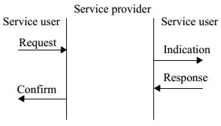

# 5.6 原语的概念

　　每一层的服务主要完成两种功能：根据它的下层服务要求，为上层提供相应的服务；另一种是根据上层的服务要求，对它的下层提供相应的服务。各项服务是通过服务原语来实现的图 7 描述了原语的概念，在图中，描述了一个具有 N 个用户的网络中，两个对等用户以及他们与 M 层(或子层)对等协议实体建立连接的服务原语。

图 7. 服务原语

　　服务是由 N 用户和 N 层之间的信息流的描述来指定的。该信息流由离散的瞬时事件构成，以提供服务为特征。每个事件由服务原语组成，它将在一个用户的某一层，通过该层的服务接入点(SAP)与建立对等连接的用户的相同层之间传送。服务原语通过提供一种特定的服务来传输必需的信息。这些服务原语是一个抽象的概念，它们仅仅指出提供的服务内容，而没有指出由谁来提供这些服务。它的定义与其他任何接口的实现无关。

　　服务由服务的原语和参数两个因素指定。

　　原语通常分为如下面四种类型：

　　—— 请求：请求原语从第 N 用户发送到它的第 N 层，请求服务开始。

　　—— 指示：指示原语是从第 N 层向第 N 用户发送，指示对于第 N 用户有重要意义的内部 N 层的事件。该事件也许与一个远程服务请求逻辑相关，或者可能是由 N 层的内部事件引起。

　　—— 响应：响应原语是从第 N 用户向它的第 N 层来表示对用户执行上一条原语调用过程的响应。

　　—— 确认：确认原语是由第 N 层向第 N 用户发送，用来传送一个或多个前面服务请求原语的执行结果。
