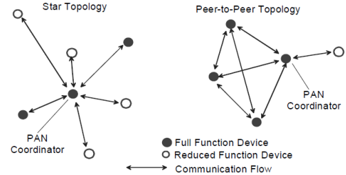
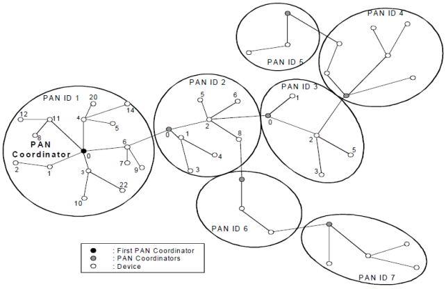

# 4.3 网络拓扑

　　根据应用的需求， IEEE 802.15.4 LR-WPAN 可以有两种网络拓扑结构：星型拓扑结构和对等拓扑结构。如图 1 所示。

图 1. 星型拓扑结构和对等拓扑结构

　　星型拓扑结构由一个叫做 PAN 主协调器的中央控制器和多个从设备组成，主协调器必须为一个具有完整功能的设备，从设备既可为完整功能设备也可为简化功能设备。在实际应用中，应根据具体应用情况，采用不同功能的设备，合理地构造通信网络。在网络通信中，通常将这些设备分为起始设备或者终点设备， PAN 主协调器既可以作为起始设备、终点设备，也可以作为路由器，是 PAN 网络的主控制器。在任何一个拓扑网络上，所有设备都有一个唯一的地址 —— 扩展地址。设备在 PAN 网络中既可以直接使用扩展地址通信，也可以使用设备被关联时所分配的短地址通信。通常，PAN 主协调器使用电源供电，其它从设备采用电池供电。

　　在对等拓扑网络结构中，同样也存在一个 PAN 主设备，但该网络不同于星型拓扑网络结构，该网络中的任何一个设备都可以与其通信范围内的其它设备进行通信。对等拓扑网络结构能够构成较为复杂的网络结构，例如网状拓扑网络结构。这种对等拓扑网络结构在工业监测和控制，无线传感器网络、供应物资跟踪、农业智能化以及安全监控等方面都有广泛的应用。对等网络允许网络中任意设备间进行多跳传输消息。

　　每个独立的 PAN 网络都有一个唯一的标识符，以允许该网络中的设备使用短地址进行通信，以及不同网络间设备的通信。标识符的选择机制不在本标准的讨论范围之内。

　　4.3.1 节和 4.3.2 节简单地介绍了一下所支持的网络拓扑的形成过程，但是具体的网络构造由上层协议完成，不属于本标准的一部分。

## 4.3.1 星型网络

　　星型网络的基本结构如图 1 所示。当一个具有完整功能的设备被激活之后，它就会建立一个自己的网络，将自身成为一个 PAN 主协调器。所有星型网络的操作独立于当前其它星型网络的操作，这就说明了在星型网络结构中只有一个唯一的 PAN 主协调器，通过选择一个 PAN 标识符确保网络的唯一性。一旦选定了 PAN 标识符， PAN 主协调器就会允许其它设备加入到它的网络中，无论是具有完整功能的设备还是简化功能的设备都可以加入到这个网络中。上层协议可以使用 5.1.2 节和 5.1.3 节所描述的步骤构造网络。

## 4.3.2 对等网络

　　在对等拓扑结构中，每个设备都可以与在无线通信范围内的其它任何设备进行通信。任何一个设备都可以定义为 PAN 主协调器，例如，可将信道中第一个通信的设备定义为 PAN 主协调器。未来的网络结构可能不仅仅局限为对等拓扑结构，对拓扑结构进行限制也是可能的。

　　例如，树簇拓扑结构是对等网络拓扑结构的一种应用形式，在对等网络中的设备可以为完整功能设备，也可以为简化功能设备。 而在树簇中的大部分设备是 FFD， RFD 只能作为一个叶结点连接在树簇拓扑结构树枝的末尾处，这主要是由于 RFD 一次只能连接一个 FFD。任何一个 FFD 都可以作为主协调器，并且，为其它从设备或主设备提供同步服务。在整个 PAN 中，只要该设备相对于 PAN 中的其它设备具有更丰富的计算资源，这样的设备都可以成为该 PAN 的主协调器。在建立一个 PAN 时，首先， PAN 主协调器将自身设置为一个簇标识符（ CID）为 0 的簇头，然后，选择一个没有使用的 PAN 标识符，并向邻近的其它设备以广播的方式发送信标帧，从而形成第一簇网络。接收到信标帧的候选设备可以在簇头中请求加入该网络，如果 PAN 主协调器允许该设备加入，那么主协调器会将该设备作为结点加入到邻近表中，成为该网络的一个从设备，同时，请求加入的设备将 PAN 协调器作为它的父结点加到邻近列表中，成为该网络的一个从设备，开始发送周期性的信标帧；其它的候选设备也可以在这台刚加入的设备上加入该网络。如果原始的候选不能加入到该网络中，那么它将寻找其它的父结点。在 5.1.2 节和 5.1.3 节中将详细描述一个 PAN 是如何启动的、以及设备是如何加入到 PAN 中的。

　　最简单的网络结构是只有一个簇的网络，但是多数网络结构由多个相邻的网络构成。一旦第一簇满足预定的应用或网络需求时， PAN 主协调器将会指定一个从设备为另一簇新网络的簇头，使得该从设备成为另一个 PAN 的主协调器，随后其它的从设备将逐个加入，形成一个多簇网络，如图2所示。图中的直线表示设备间的父子关系而不是通信流。多簇网络结构的优点在于增加网络的覆盖范围，但随之而来的缺点是会增加传输信息的延迟时间。

图 2. 簇数网络

